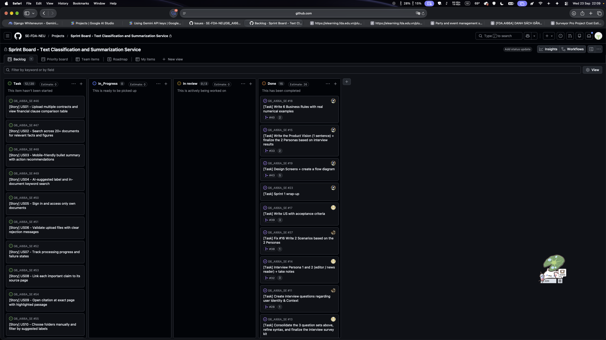
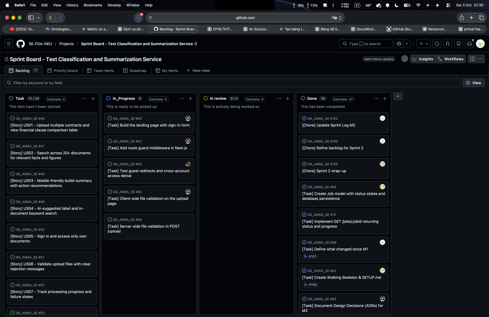
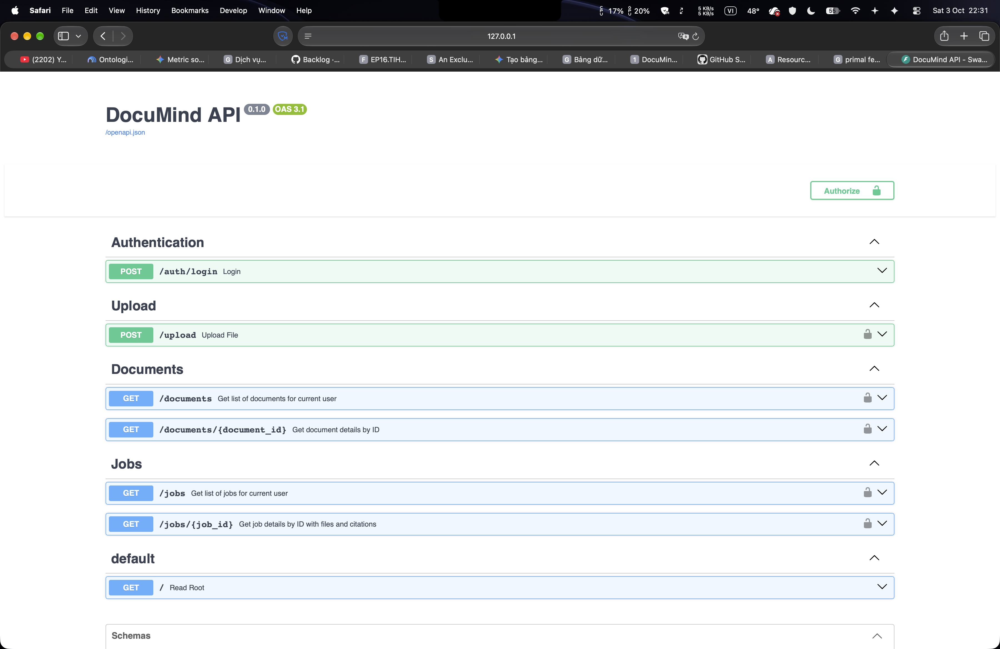

# DocuMind — System Design

```
Team:           Team 06 — DocuMind
Topic:          C2
Members:        To Hien Hai Dang (11247271), Phan Dang Vu (11247373),
                Bui Dang Duong (11247274), Nguyen Bao Tai (11247348)
Product Owner:  @PhanDangVu
Scrum Master:   @duongbui0811       (Sprint 2 — must differ from Sprint 1)

Repository:     https://github.com/SE-FDA-NEU/G6_AI66A_SE.git
Project board:  https://github.com/orgs/SE-FDA-NEU/projects/24
Setup guide:    https://github.com/SE-FDA-NEU/G6_AI66A_SE/blob/main/docs/SETUP.md

Submitted by:   Phan Dang Vu
```


## Project board screenshots

### After Sprint Planning (Sep 22)



### On submission day (Oct 5)




## Walking skeleton running




---

## 3.1 Architecture

```text
┌───────────────────┐    HTTP (JSON/JWT)    ┌─────────────────────────┐
│     Browser       │ ────────────────────► │      FastAPI App        │
│ (Swagger/React)   │ ◄──────────────────── │      backend/app        │
└───────────────────┘     JSON response     └───────────┬─────────────┘
                                                        │ function calls
                                                        ▼
                                            ┌─────────────────────────┐
                                            │      Core Services      │
                                            │   auth, jobs, upload    │
                                            │   (enforces BR1–BR7)    │markdown
                                            └───────────┬─────────────┘
                                                        │ SQL (SQLAlchemy)
                                                        ▼
                                            ┌─────────────────────────┐
                                            │     MySQL Database      │
                                            │       documind_db       │
                                            └─────────────────────────┘
```

## 3.2 Data model

### ERD (Entity Relationship Diagram)


---


## Table definitions

| Table         | Columns                                                                                                                                                                                                                                                                                                                           | Constraint · which M1 rule                                                                                                                                                                                                                                                                                                                                                                                                                                           |
| ------------- | --------------------------------------------------------------------------------------------------------------------------------------------------------------------------------------------------------------------------------------------------------------------------------------------------------------------------------- | -------------------------------------------------------------------------------------------------------------------------------------------------------------------------------------------------------------------------------------------------------------------------------------------------------------------------------------------------------------------------------------------------------------------------------------------------------------------- |
| **users**     | `id` PK · `username` UNIQUE · `email` UNIQUE · `password_hash` · `created_at`                                                                                                                                                                                                                                                     | `username`, `email`, and `password_hash` are required. Authentication identifies the owner of protected data; document and job access must be checked against that owner. **BR07**                                                                                                                                                                                                                                                                                   |
| **folders**   | `id` PK · `owner_id` FK → `users.id` · `name` · `created_at`                                                                                                                                                                                                                                                                      | `owner_id` and `name` are required. Only the owner may create or manage a folder. Folder placement is always chosen by the user; an AI label must not create or move a folder. **BR03, BR07**                                                                                                                                                                                                                                                                        |
| **documents** | `id` PK · `owner_id` FK → `users.id` · `folder_id` FK → `folders.id` NULL · `original_filename` · `storage_path` · `file_format` · `file_size_bytes` · `page_count` NULL · `ai_label` NULL · `ai_confidence` NULL · `review_state` · `user_label` NULL · `extracted_text` NULL · `last_accessed_at` · `expires_at` · `created_at` | `owner_id`, file metadata, and retention timestamps are required. Format is PDF/DOCX/PPTX and each file is at most 5 MB; validate before insert. `folder_id` may stay NULL and may only reference the same owner's folder. Keep AI suggestion/confidence separate from the user label and folder; below 80% confidence, show Needs review. Set expiry to 30 days after last access and warn seven days before deletion. **BR01, BR03, BR06, BR07**                   |
| **jobs**      | `id` PK · `owner_id` FK → `users.id` · `mode` · `status` · `file_count` · `completed_count` · `result_data` NULL · `created_at` · `finished_at` NULL                                                                                                                                                                              | A submission has at most five files and at most 50 MB combined; check these limits before creating a job. `mode` is `bullet`, `table`, or `concept`. Track progress from `pending` to a terminal status; a five-contract table has a five-minute target and a 15-page bullet summary has a three-minute target. Limit a general summary to 1,000 words and a concept overview to three to five concepts. Only the owner may read the job. **BR01, BR02, BR04, BR07** |
| **job_files** | `id` PK · `job_id` FK → `jobs.id` · `document_id` FK → `documents.id` · `status` · `attempt_count` · `timeout_seconds` NULL · `error_message` NULL · `created_at`                                                                                                                                                                 | One row links one document to one processing job. The job and document must belong to the same user. Preserve each file's progress and failure state so a failed item is not reported as completed. **BR02, BR07**                                                                                                                                                                                                                                                   |
| **citations** | `id` PK · `job_id` FK → `jobs.id` · `document_id` FK → `documents.id` · `claim_text` · `doc_name` · `page` NULL · `text_span` NULL · `unverified` · `created_at`                                                                                                                                                                  | The citation's job and document must share an owner. A verified amount, date, percentage, or clause needs a source document and page; if the source cannot be located, set `unverified = true` and show Unverified. `text_span` supports highlighting when available. **BR05, BR07**                                                                                                                                                                                 |

---

## 3.3 API design

| Method    | Path                              | Input                                                                               | Success                                                                                         | Errors                                                                                                                               |
| :-------- | :-------------------------------- | :---------------------------------------------------------------------------------- | :---------------------------------------------------------------------------------------------- | :----------------------------------------------------------------------------------------------------------------------------------- |
| **POST**  | `/auth/login`                     | Form:<br>`username`, `password`                                                     | `200` &middot; `access_token`, `token_type`                                                     | `401` invalid credentials;<br>`422` missing form fields                                                                              |
| **POST**  | `/upload`                         | Multipart: `files` (1–5 PDF/DOCX/PPTX files), `mode` (`bullet`, `table`, `concept`) | `202` &middot; `job_id`, `status: pending`, accepted document IDs                               | `401` no valid token (**BR07**);<br>`413` file > 5 MB or batch > 50 MB (**BR01**);<br>`422` invalid format, count or mode (**BR01**) |
| **GET**   | `/documents`                      | Query:<br>`folder_id?`, `label?`, `review_state?`                                   | `200` &middot; current user's document list with suggested labels, folder and processing status | `401` unauthenticated (**BR07**);<br>`422` invalid filter                                                                            |
| **GET**   | `/documents/{document_id}`        | Path:<br>`document_id`                                                              | `200` &middot; document metadata, AI label/confidence, user label, folder, page count, expiry   | `401` unauthenticated;<br>`404` absent or not owned (**BR07**)                                                                       |
| **GET**   | `/documents/{document_id}/file`   | Path: `document_id`;<br>query: `page?`                                              | `200` &middot; original file for the reader; `page` selects the initial view                    | `401` unauthenticated;<br>`404` absent or not owned (**BR07**);<br>`422` page outside document                                       |
| **PATCH** | `/documents/{document_id}/label`  | JSON:<br>`user_label`, `review_state`                                               | `200` &middot; saved user label; original AI suggestion retained                                | `401` unauthenticated;<br>`404` absent or not owned (**BR07**);<br>`422` invalid label (**BR03**)                                    |
| **PATCH** | `/documents/{document_id}/folder` | JSON:<br>`folder_id` or `null` to leave unfiled                                     | `200` &middot; updated folder; AI label unchanged                                               | `401` unauthenticated;<br>`404` document or folder absent/not owned (**BR07**);<br>`422` invalid folder ID (**BR03**)                |
| **GET**   | `/folders`                        | —                                                                                   | `200` &middot; folders owned by the current user                                                | `401` unauthenticated (**BR07**)                                                                                                     |
| **POST**  | `/folders`                        | JSON: `name`                                                                        | `201` &middot; `folder_id`, `name`                                                              | `401` unauthenticated (**BR07**);<br>`422` blank or invalid name                                                                     |
| **GET**   | `/search`                         | Query:<br>`q`, `folder_id?`, `label?`                                               | `200` &middot; relevance-ranked search results                                                  | `401` unauthenticated (**BR07**);<br>`422` missing query `q`                                                                         |

---

## 3.4 Walking skeleton

> **Route:** `GET /documents` · **Table:** `documents` (40 rows seeded across 4 users, 10 documents per user)  
> **Source Repository:** `https://github.com/Dangtooo/G6_AI66A_SE.git`

---

### 1. Prerequisites

No pre-installed software is assumed. A fresh machine requires the following tools:

- **Git:** version `2.40+` ([Download Git](https://git-scm.com/))
- **Python:** version `3.11+` or `3.12+` (with `pip` and `venv`) ([Download Python](https://www.python.org/))
- **MySQL Server:** version `8.0+` (running on default port `3306`) ([Download MySQL](https://dev.mysql.com/downloads/installer/))

---

### 2. Setup Commands (Step-by-step)

Follow the commands in sequential order. Choose the command corresponding to your operating system.

> **Quick Reference (For Experienced Developers):**
>
> ```bash
> git clone https://github.com/Dangtooo/G6_AI66A_SE.git
> cd G6_AI66A_SE/backend
> python -m venv .venv
> .venv\Scripts\activate       # macOS / Linux: source .venv/bin/activate
> pip install -r requirements.txt
> copy .env.example .env       # macOS / Linux: cp .env.example .env
> # STOP & EDIT: Update DB_PASSWORD in backend/.env before continuing!
> python src/init_db.py
> uvicorn app.main:app --reload
> ```

### Step-by-Step Installation

```bash
# 1. Clone the repository
git clone https://github.com/Dangtooo/G6_AI66A_SE.git
cd G6_AI66A_SE/backend

# 2. Create Python virtual environment
python -m venv .venv

# 3. Activate the virtual environment:
# On Windows (Command Prompt or PowerShell):
.venv\Scripts\activate
# On macOS / Linux:
source .venv/bin/activate

# 4. Install dependencies
pip install -r requirements.txt

# 5. Create local environment configuration file:
# On Windows:
copy .env.example .env
# On macOS / Linux:
cp .env.example .env
```

> **CRITICAL: Configure `.env` before proceeding to database initialization!**  
> Do not execute database scripts yet. You **must** open `backend/.env` and update your MySQL password (`DB_PASSWORD`) in **[Section 3: Configuration (`.env`)](#3-configuration-env)** below before running the database seeding in Section 4. Otherwise, database initialization will fail with an authentication error.

---

### 3. Configuration (`.env`)

Open the newly created `backend/.env` file in your text editor and configure your local Database connection details:

> **Prerequisite for Database Initialization:**  
> The database script (`init_db.py`) relies on these credentials to connect to your local MySQL server and create `documind_db`. If `DB_PASSWORD` is incorrect or left as default, database initialization will fail.

| Environment Variable          | Sample / Default Value          | Description & Instructions                           |
| ----------------------------- | ------------------------------- | ---------------------------------------------------- |
| `DB_USER`                     | `root`                          | MySQL username on your machine                       |
| `DB_PASSWORD`                 | `your_mysql_password`           | **Required:** Set to your actual MySQL root password |
| `DB_HOST`                     | `localhost`                     | MySQL host address                                   |
| `DB_PORT`                     | `3306`                          | MySQL service port                                   |
| `DB_NAME`                     | `documind_db`                   | Database name (auto-created if not exists)           |
| `SECRET_KEY`                  | `super_secret_key_documind_123` | Secret key used to sign and decode JWT tokens        |
| `ALGORITHM`                   | `HS256`                         | JWT encryption algorithm                             |
| `ACCESS_TOKEN_EXPIRE_MINUTES` | `1440`                          | JWT token lifespan (1440 minutes = 24 hours)         |

---

### 4. Database Creation & Seeding

After configuring `.env` with your valid MySQL credentials, execute database creation, table schema generation, and sample data seeding with **a single command**:

```bash
python src/init_db.py
```

### Number of Seeded Rows:

- **`users`:** **4 rows** (`demouser`, `admin`, `testuser`, `guest` — default password: `123456`).
- **`folders`:** **4 rows** (each user owns 1 dedicated folder).
- **`documents`:** **40 rows** (each user has exactly **10 documents** across PDF, DOCX, and PPTX formats).
- **`jobs`:** **20 rows** (each user has 5 processing jobs across `bullet`, `table`, and `concept` modes).
- **`job_files`:** **32 rows** (associating jobs with documents).
- **`citations`:** **12 rows** (factual evidence and citations).

### Start the Backend Server

Once the database has been successfully initialized and seeded, start the FastAPI development server:


```bash
uvicorn app.main:app --reload
```

---

### 5. How to Know It Worked (Verification Guide)

The walking skeleton route is **`GET /documents`**. Because the system enforces Business Rule **BR07** (Users can only view their own documents), this route requires a Bearer JWT token.

### Verification Steps via Swagger UI:

1. Open your browser and navigate to:  
   **`http://localhost:8000/docs`**
2. **Log in to obtain a Token:**
   - Under `Authentication`, click on **`POST /auth/login`**.
   - Click **"Try it out"**, enter `username`: `demouser`, `password`: `123456`, then click **"Execute"**.
   - Copy the `access_token` string from the response body.
3. **Authorize:**
   - Scroll to the top of the Swagger UI page, click the green **Authorize ** button.
   - Paste the token into the **Value** field and click **Authorize**, then click **Close**.
4. **Call `GET /documents`:**
   - Under `Documents`, click on **`GET /documents`**.
   - Click **"Try it out"** > click **"Execute"**.

### Expected Response:

The server returns HTTP Status **`200 OK`** with exactly **10 documents** belonging to `demouser` (with `extracted_text` deferred to optimize payload):

```json
[
  {
    "id": 1,
    "owner_id": 1,
    "folder_id": 1,
    "original_filename": "hop_dong_lao_dong.pdf",
    "storage_path": "/storage/demouser/hop_dong_lao_dong.pdf",
    "file_format": "PDF",
    "file_size_bytes": 1048576,
    "page_count": 6,
    "ai_label": "Hợp đồng",
    "ai_confidence": 0.95,
    "review_state": "confirmed",
    "user_label": "Hợp đồng nhân sự",
    "last_accessed_at": "2026-09-30T14:00:00",
    "expires_at": "2026-10-30T14:00:00",
    "created_at": "2026-09-30T14:00:00"
  },
  {
    "id": 2,
    "owner_id": 1,
    "folder_id": 1,
    "original_filename": "bao_cao_tai_chinh_q3.docx",
    "storage_path": "/storage/demouser/bao_cao_tai_chinh_q3.docx",
    "file_format": "DOCX",
    "file_size_bytes": 2097152,
    "page_count": 12,
    "ai_label": "Tài chính",
    "ai_confidence": 0.88,
    "review_state": "confirmed",
    "user_label": "Báo cáo Q3",
    "last_accessed_at": "2026-09-30T14:00:00",
    "expires_at": "2026-10-30T14:00:00",
    "created_at": "2026-09-30T14:00:00"
  }
]
```

_(Or quickly test using a single cURL command)_:

```bash
curl -X GET "http://localhost:8000/documents?skip=0&limit=50" -H "Authorization: Bearer <TOKEN_FROM_LOGIN>"
```

### Screenshot of the Running Page:

The screenshot below demonstrates the running API endpoint on Swagger UI (`http://127.0.0.1:8000/documents?skip=0&limit=50`) returning HTTP `200 OK` with the seeded documents:


---

### 6. The Query Behind the Page (Query in `design.md`)

When a user calls `GET /documents`, SQLAlchemy generates the following equivalent SQL query (filtering by the authenticated user's `owner_id` and excluding `extracted_text` via `defer`):

```sql
SELECT
    documents.id,
    documents.owner_id,
    documents.folder_id,
    documents.original_filename,
    documents.storage_path,
    documents.file_format,
    documents.file_size_bytes,
    documents.page_count,
    documents.ai_label,
    documents.ai_confidence,
    documents.review_state,
    documents.user_label,
    documents.last_accessed_at,
    documents.expires_at,
    documents.created_at
FROM documents
WHERE documents.owner_id = 1
ORDER BY documents.created_at DESC
LIMIT 50 OFFSET 0;
```

### Screenshot of SQL Query and Fetched Data:

The screenshot below shows the executed query in the database client and the resulting records returned from the `documents` table:


---

### 7. Troubleshooting (Common Issues on Fresh Machines)

### Issue 1: `sqlalchemy.exc.OperationalError: Can't connect to MySQL server on 'localhost' ([WinError 10061])`

- **Cause:** The MySQL service is not running or the `DB_PASSWORD` in `.env` is incorrect.
- **Resolution:**
  - On Windows: Run PowerShell as Admin and execute `net start MySQL80` (or open `services.msc` > Start `MySQL80` service).
  - On macOS/Linux: Run `sudo systemctl start mysql` (or `brew services start mysql`).
  - Open `.env` and verify your `DB_PASSWORD`.

### Issue 2: `HTTP 401 Unauthorized` (`{"detail": "Not authenticated"}`)

- **Cause:** Called `GET /documents` without providing the `Authorization: Bearer <token>` header.
- **Resolution:**
  - Call `POST /auth/login` with `demouser` / `123456` to get a token.
  - On Swagger UI: Click the **Authorize ** button and paste the token.

### Issue 3: `ModuleNotFoundError: No module named 'app'`

- **Cause:** You are running commands from the `backend/app/` subdirectory instead of the `backend/` root directory.
- **Resolution:**
  - Run `cd ..` to return to the `backend/` directory, then re-run `uvicorn app.main:app --reload`.

---

### 8. Tested By (Independent Verification Log)

- **Tester:** `@hoang3003` (Team 3)
- **Environment:** Fresh Windows 11 Laptop (fresh clone)
- **Execution Time:** 2026-10-1 — **6 minutes**
- **Result:** Successfully executed all steps from clone to running the server and testing `GET /documents` on Swagger UI with 100% pass rate, returning exactly 10 documents for user `demouser`.

---

## 3.5 Architecture Decision Records

### Decision 1 - MySQL 8.x instead of SQLite or PostgreSQL

- **Options**: SQLite file · PostgreSQL in Docker · MySQL 8.x.
- **Chose**: MySQL 8.x.
- **Why**: SQLite's database-level lock would cause errors during concurrent writes from our background AI workers. PostgreSQL adds Docker complexity to the local setup and uses too much RAM for an AWS Free Tier server. MySQL provides the necessary row-level locking natively without the overhead.
- **What would change our mind**: If our app required complex JSONB analytics or geospatial queries that MySQL couldn't handle efficiently, we would move to PostgreSQL.

### Decision 2 — Tracking status in both `jobs` and `job_files`

- **Options**: Status in `jobs` only · Status in `job_files` only · Status in both.
- **Chose**: Status in both.
- **Why**: Our batch processing allows up to 5 files per job. Tracking status globally in jobs is needed for the overall UI progress bar, but tracking in `job_files` is strictly required to identify exactly which specific file failed and why.
- **What would change our mind**: If we disabled batch processing and restricted users to strictly one file per upload, `job_files` would become redundant and we would merge the status into the `documents` table.

## 3.6 What changed since M1

**Change 1 — Added `storage_path` to the documents table.**
M1 defined file upload rules (BR01) but did not specify where accepted files would be stored. Our first database draft stored file content as a BLOB column. During Sprint 2 we replaced it with a `storage_path TEXT` column so that files live on disk (or S3 in production) and the database stays small and fast.

**Change 2 — Created a dedicated `citations` table.**
M1's BR05 required every verified fact to link to a source document and page, but the data model was not yet designed. Our initial approach was to embed citations inside the `result_data` JSON column of the `jobs` table. We extracted them into a separate `citations` table with `claim_text`, `page`, `text_span` and `unverified` columns so that the frontend can query individual citations directly and the database can enforce referential integrity between citations, jobs and documents.
