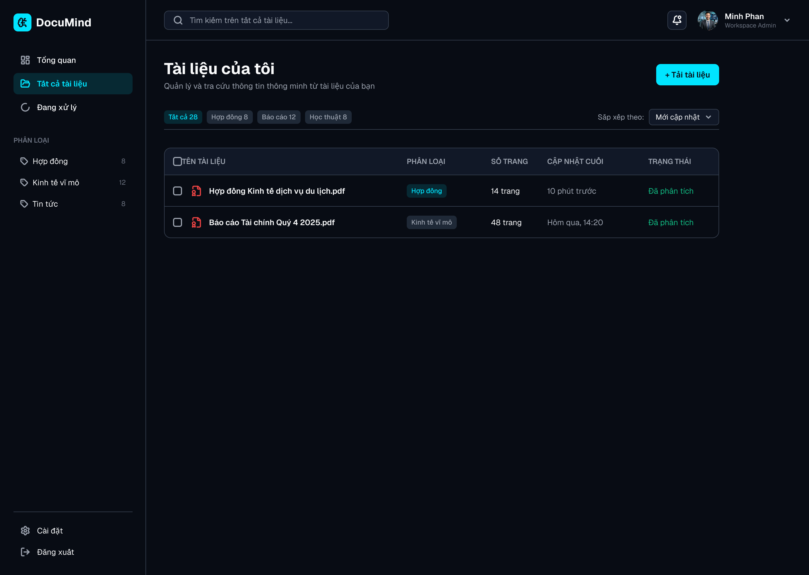
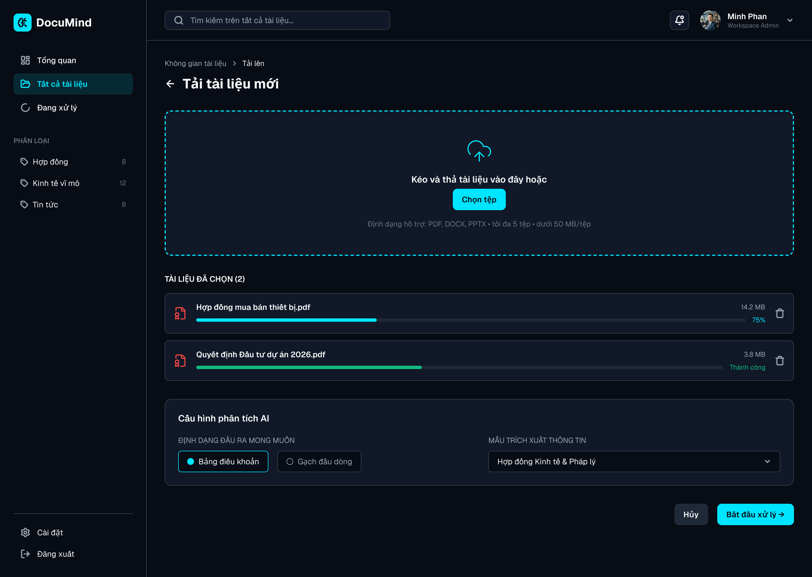
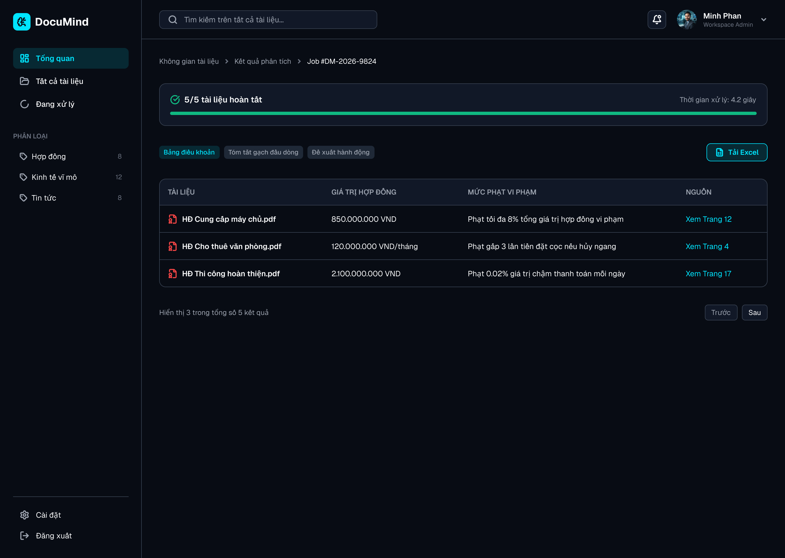
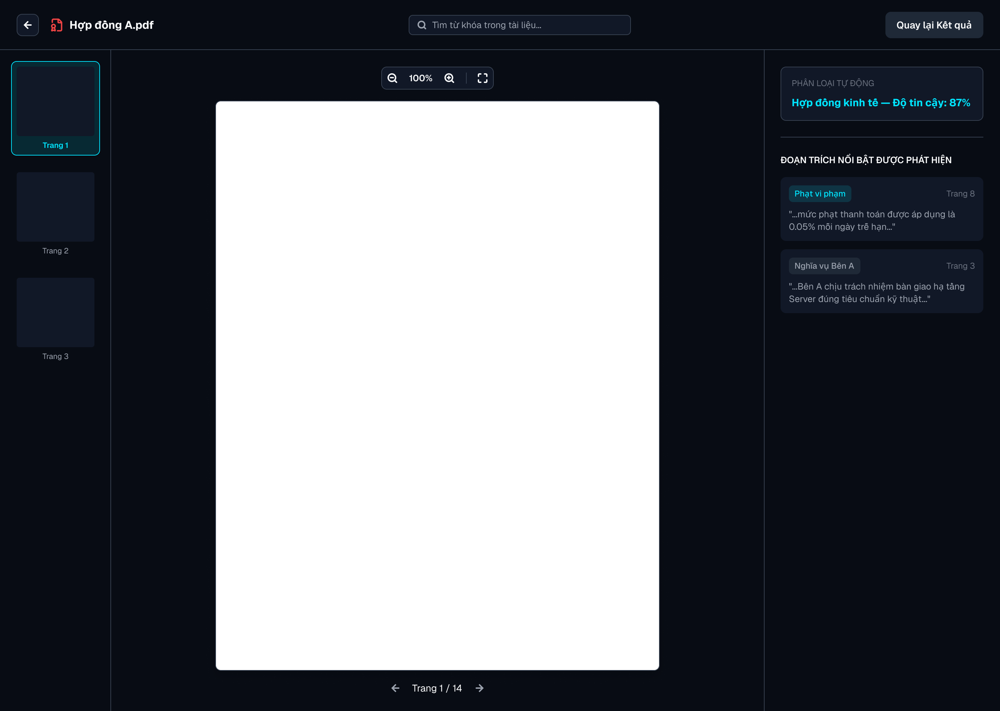

# Thiết kế 5 màn hình và luồng điều hướng

## 1. Phạm vi thiết kế

Thiết kế này được xây dựng từ 4 user stories trong `requirements.md`:

- US01: tải nhiều hợp đồng và xem bảng trích xuất số liệu.
- US02: tìm kiếm trên nhiều tài liệu và mở đúng nguồn trích dẫn.
- US03: xem tóm tắt dạng gạch đầu dòng trên thiết bị di động.
- US04: tự động gắn nhãn và tìm kiếm, tô sáng nội dung trong tài liệu.

Hệ thống sử dụng đúng **5 màn hình**. Chức năng quản trị chưa có user story hoặc acceptance criteria nên không tạo thêm màn hình Admin trong phạm vi này.

## 2. Bảng màn hình

| Route | Purpose | Access (G, U, A) | Priority |
|---|---|---|---|
| `/` | Giới thiệu sản phẩm và cho phép người dùng đăng nhập để bắt đầu | G | P0 |
| `/workspace` | Quản lý tài liệu, nhãn và tìm kiếm ngữ nghĩa trên nhiều tài liệu | U | P0 |
| `/upload` | Chọn tệp, kiểm tra điều kiện và cấu hình kiểu tóm tắt trước khi xử lý | U | P0 |
| `/results/:jobId` | Theo dõi tiến trình và xem kết quả dạng bảng hoặc gạch đầu dòng | U | P0 |
| `/documents/:documentId` | Đọc tài liệu gốc, tìm kiếm nội bộ, chuyển trang và tô sáng trích dẫn | U | P0 |

**Mã truy cập:** G = khách chưa đăng nhập; U = người dùng đã đăng nhập; A = quản trị viên. Người dùng A có thể dùng các màn hình dành cho U, nhưng dự án hiện chưa yêu cầu màn hình chỉ dành riêng cho A.

## 3. Thiết kế 5 màn hình Desktop Web

Các thiết kế dưới đây dành cho màn hình web desktop rộng khoảng **1440 px**. Riêng US03 vẫn được hỗ trợ bằng responsive design khi người dùng mở hệ thống trên điện thoại.

### Screen 1 — Landing/Login (`/`)


**Mục đích:** giới thiệu giá trị của DocuMind và đưa người dùng vào hệ thống. Nút `Đăng nhập` hoặc `Bắt đầu ngay` dẫn đến `/workspace` sau khi xác thực thành công.

### Screen 2 — Workspace (`/workspace`)



**Mục đích:** hiển thị danh sách tài liệu, nhãn phân loại, trạng thái xử lý và thanh tìm kiếm trên toàn bộ kho tài liệu. Nút `Tải tài liệu` dẫn đến `/upload`; chọn một tài liệu dẫn đến `/documents/:documentId`.

### Screen 3 — Upload (`/upload`)



**Mục đích:** cho phép kéo thả hoặc chọn tối đa 5 tệp, theo dõi tiến trình tải lên và cấu hình kiểu phân tích AI. Nhấn `Bắt đầu xử lý` sẽ tạo một job và chuyển đến `/results/:jobId`.

### Screen 4 — Processing/Results (`/results/:jobId`)



**Mục đích:** hiển thị trạng thái xử lý, bảng điều khoản, tóm tắt gạch đầu dòng, đề xuất hành động và nguồn trích dẫn. Nhấn `Xem Trang` sẽ mở `/documents/:documentId` tại đúng trang nguồn.

**Responsive cho US03:** khi chiều rộng nhỏ hơn 768 px, sidebar được thu vào menu, bảng chuyển thành các thẻ xếp dọc, nội dung không tràn chiều rộng và phần `Đề xuất hành động` có ít nhất 2 phương án.

### Screen 5 — Document Reader (`/documents/:documentId`)



**Mục đích:** đọc tài liệu gốc, tìm kiếm nội bộ, xem nhãn tự động và mở các đoạn trích nổi bật. Khi người dùng đến từ một trích dẫn, màn hình tự chuyển đến đúng trang và tô sáng nội dung liên quan. Nút `Quay lại Kết quả` đưa người dùng về `/results/:jobId`.

## 4. Flow Diagram

```sql
                         ┌─────────────────┐
                         │        /        │  guest user
                         │ Landing / Login │
                         └────────┬────────┘
                                  │ sign in successfully
                                  ▼
                       ┌───────────────────────┐
              ┌───────▶│      /workspace      │◀──────────────┐
              │        │  Document Workspace  │               │
              │        └──────┬─────────┬──────┘               │
              │               │         │                      │
              │  cancel       │         │ open existing        │
              │  upload       │         │ document             │
              │               │         └───────────────┐      │
              │               │ upload documents       │      │
              │               ▼                        │      │
              │        ┌───────────────┐                │      │
              └────────┤    /upload    │                │      │
                       │ Upload Files  │                │      │
                       └───────┬───────┘                │      │
                               │ start processing       │      │
                               ▼                        │      │
                    ┌───────────────────────┐            │      │
                    │    /results/:jobId    │            │      │
                    │ Processing & Results  │            │      │
                    └───────────┬───────────┘            │      │
                                │ open source citation   │      │
                                ▼                        ▼      │
                    ┌───────────────────────────────┐            │
                    │ /documents/:documentId        │            │
                    │ Document Reader               ├────────────┘
                    └───────────────────────────────┘  back to workspace
```

